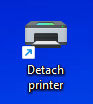

# USB/IP server

Share USB devices through the network.

- Sources:
    - https://duckduckgo.com/?q=share+scanner+over+network&ia=web
    - https://duckduckgo.com/?q=usb+over+network&ia=web
    - How To Share USB Devices Over Network with Raspberry Pi [Novaspirit Tech]: https://www.youtube.com/watch?v=gBCNLs_5pwM
    - https://derushadigital.com/other%20projects/2019/02/19/RPi-USBIP-ZWave.html
    - https://duckduckgo.com/?q=usbip&ia=web
    - https://wiki.archlinux.org/title/USB/IP
        - parametrized systemd service for binding/unbinding the device from the server: https://wiki.archlinux.org/title/USB/IP#Binding_with_systemd_service
    - https://man.archlinux.org/man/usbip.8
        - reference for more readable keyword options
    - https://man.archlinux.org/man/usbipd.8
        - reference for more readable keyword options
    - https://archlinux.org/packages/community/x86_64/usbip/

- Limitations
    - the device needs to be connected to the same USB port on the server all the time
        - when using a different port, this solution needs to be modified entirely
    - when physically disconnecting the device from the USB/IP server, the server/systemd service needs to be restarted
    - only one user at a time can use an already exported/bound and connected/attached device.

1. **Server** - Installation

    1. Clone this repository to the server, e.g. to the home directory of current user.

        Open `Git Bash` and enter following commands

            cd

            mkdir git

            cd git

            git clone https://github.com/kyberdrb/usbip_server

    - **Linux**
        - **Arch Linux**

                sudo pacman --sync --refresh usbip

        - **Debian/Ubuntu/Raspberry Pi OS**

                sudo aptitude install usbip

    - **Windows**

            TODO - not necessary yet

1. **Server** - First configuration
    1. Load the kernel module for the USBIP server

            sudo modprobe usbip_host

    1. Verify that the module is loaded

            lsmod | grep usbip

    1. Load the module at system startup

        **Debian/Ubuntu/Raspberry Pi OS** - see [example for Debian-based server](configs/server/Debian-Ubuntu-Raspberry_Pi_OS/etc/modules)

            echo 'usbip_host' | sudo tee --append /etc/modules

        **Arch Linux** - see [example for Arch Linux server](configs/server/Arch_Linux/etc/modules-load.d/usbip.conf)

            echo 'usbip_host' | sudo tee --append /etc/modules-load.d/usbip.conf

        Verify whether the module loads at boot by restarting the system

            sudo reboot

        - Sources:
            - https://wiki.archlinux.org/title/Kernel_module
            - https://wiki.archlinux.org/title/Kernel_module#Manual_module_handling
            - https://wiki.archlinux.org/title/Kernel_module#Obtaining_information
            - https://wiki.archlinux.org/title/Kernel_module#systemd

    1. Make the USB/IP server process start on boot (together with binding a particular device if desired) to reduce the accessing to the server each time we want to share and attach device to minimum - the server does the binding automatically at startup for us
        1. Create the base `usbipd.service` (see [example](scripts/server/usbipd.service)) for starting and stopping USB/IP server

                $ sudo vim /etc/systemd/system/usbipd.service

                [Unit]
                Description=Start/Stop sharing bound USB devices via USB/IP server
                After=network.target

                [Service]
                Type=oneshot
                ExecStart=/usr/sbin/usbipd --daemon
                RemainAfterExit=yes
                ExecStop=killall usbipd
                ExecReload=/bin/sh -c "killall usbipd; /usr/sbin/usbipd --daemon"
                Restart=on-failure

                [Install]
                WantedBy=multi-user.target

            The option `RemainAfterExit=yes` assures, that the `systemd` executes only the `ExecStart` command (and `ExecStartPre` and `ExecStartPost` options). When we ommit the `RemainAfterExit` option or set it to `RemainAfterExit=no` then the systemd would execute the `ExecStart` commands and then jump immediatly to execution of `ExecStop` commands.

        1. Create the service `usbip-printer.service` (see [example](scripts/server/usbip-printer.service)) for enabling and disabling device sharing, e.g. printer, via USB/IP server (the shared device is physically connected to the printer via USB port)

                $ sudo vim /etc/systemd/system/usbip-printer.service

                [Unit]
                Description=Share printer and scanner via USB/IP by binding them to server
                After=network.target usbipd.service
                Requires=usbipd.service

                [Service]
                Type=oneshot
                ExecStartPre=-/usr/sbin/usbip unbind --busid=1-1.3
                ExecStart=/usr/sbin/usbip bind --busid=1-1.3
                RemainAfterExit=yes
                ExecStop=/usr/sbin/usbip unbind --busid=1-1.3
                Restart=on-failure
                ExecReload=/bin/sh -c "/usr/sbin/usbip unbind --busid=1-1.3; /usr/sbin/usbip bind --busid=1-1.3"

                [Install]
                WantedBy=multi-user.target

            and then test the service (enable USB device sharing) with

                sudo systemctl start usbip-printer.service

            then test reloading the service (disable and enable USB device sharing) with

                sudo systemctl reload usbip-printer.service

            then test stopping the service (disable USB device sharing) with

                sudo systemctl stop usbip-printer.service

            When everything went well, enable the service at startup and start it right away with

                sudo systemctl enable --now usbip-printer.service

            - Sources
                - https://duckduckgo.com/?q=raspberry+pi+start+script+on+startup&ia=web
                - https://www.wikihow.com/Execute-a-Script-at-Startup-on-the-Raspberry-Pi
                - https://www.makeuseof.com/how-to-run-a-raspberry-pi-program-script-at-startup/

            Reboot the system. After reboot, the service `usbip-printer.service` starts the `usbipd.service` too and before starting the `usbip-printer.service`, because `usbip-printer.service` requires `usbipd.service`. The `systemd` takes care of starting all dependent/required services.

    - Sources:
        - https://duckduckgo.com/?q=execstop+executes+every+time&ia=web
        - https://superuser.com/questions/1223957/systemd-execstop-run-immediately-after-execstart/1287864#1287864
            - use `oneshot` with `[Service]` option `RemainAfterExit=yes`
        - https://duckduckgo.com/?q=systemd+service+bsd+man+doc&ia=web
        - https://www.freedesktop.org/software/systemd/man/systemd.service.html
        - https://duckduckgo.com/?q=systemd+service+oneshot+vs+simple&ia=web
        - https://trstringer.com/simple-vs-oneshot-systemd-service/
        - https://duckduckgo.com/?q=systemd+service+example+start+stop&iax=images&ia=images&iai=https%3A%2F%2Forigin-sysadmin.redhat.com%2Fsites%2Fdefault%2Ffiles%2Fstyles%2Fembed_large%2Fpublic%2F2020-02%2FImage%25202.png%3Fitok%3DuxMy3BfH
        - https://duckduckgo.com/?q=multiple+commands+execstart&ia=web
        - stackoverflow.com/questions/72665986/how-to-execute-multiple-command-in-execstart
        - https://stackoverflow.com/questions/72665986/how-to-execute-multiple-command-in-execstart
        - https://stackoverflow.com/questions/72665986/how-to-execute-multiple-command-in-execstart/72666379#72666379
        - https://duckduckgo.com/?q=execrestart&ia=web
        - https://serverfault.com/questions/1097312/unknown-key-name-execrestart-in-section-service

    - Restart the `usbip-printer.service` to make it sharable and available for for others to attach when somebody forgets to detach it.

        - Automatically restart the `usbip-printer.service` - periodically - via a cron job - to ommit the access to the server

            SERVER:

                sudo crontab -e

                */15 * * * * systemctl restart usbip-printer.service

            This cron job restart the service that is responsible for enabling and disabling printer sharing every 15 minutes, i.e. every 0th, 15th, 30th and 45th minute every hour of every day, which is enough time to remember, plan and print approximately 15 pages (with hiccups).

                sudo crontab -l

                # Edit this file to introduce tasks to be run by cron.
                #
                <~~snip~~>
                #
                # For more information see the manual pages of crontab(5) and cron(8)
                #
                # m h  dom mon dow   command

                */15 * * * * systemctl restart usbip-printer.service

            **TEST CASE:**  
            The user of computer `CLIENT 1` (Windows) forgot to detach the printer after using it. The user of computer `CLIENT 2` (Linux) wants to use the printer.

            In that case
            - either the first user tells the second user to manually detach the printer, which makes it shareable again and visible and available for attaching for the first user
            **or**
            - the first user waits until the server restarts printer sharing to attach the printer.

            In either case, in the meantime, the users can add tasks to the printing queue while the printer is still offline, i.e. disconnected or detached or locally unavailable.

            SERVER - restarting the service for sharing the printer/device to make the shared device available for all clients when one of the clients attached the device and forgot to detach the device.

                date && sudo systemctl status usbip-printer.service

            

            CLIENT 1

                date && usbip port
                
                date && usbip list --remote=192.168.31.204

                date && usbip attach --busid=1-1.3 --remote=192.168.31.204

            

            CLIENT 2

                date && sudo usbip port
                
                date && sudo usbip list --remote=192.168.31.204

            

            SERVER

            Restart the usbip printer sharing service

                sudo systemctl status usbip-printer.service

                sudo systemctl restart usbip-printer.service

            

            After the automatic/manual restart of the service, i.e `bind`ing and `unbind`ing the device with the `usbip` utility, the printer is again visible on the network for other clients, i.e the printer is exported, thus is sharable from the USB/IP server attachable for all USB/IP clients.

            CLIENT 1

                usbip port

                usbip list --remote=192.168.31.204

            

            CLIENT 2

                date && sudo usbip list --remote=192.168.31.204

            

            Let's now attach the shared device/printer to the CLIENT 2

                date && sudo usbip port
                
                date && sudo usbip list --remote=192.168.31.204

                date && sudo usbip attach --busid=1-1.3 --remote=192.168.31.204

            

            CLIENT 1 - the shared printer/device is now invisible for the CLIENT 1

                date && sudo usbip port
                
                date && sudo usbip list --remote=192.168.31.204

            

            SERVER - restarting the sharing service to restore visibility for all clients when somebody forgots to detach the shared device

                sudo systemctl status usbip-printer.service

                sudo systemctl restart usbip-printer.service

            

            CLIENT 1 - attached shared device had been detached and visibility of the shared device had been restored

                date && sudo usbip port
                
                date && sudo usbip list --remote=192.168.31.204

            

            CLIENT 2 - invisible shared device is visible again

                date && sudo usbip port
                
                date && sudo usbip list --remote=192.168.31.204

            

            - Sources:
                - https://duckduckgo.com/?q=linux+execute+command+periodically&ia=web
                - https://www.tecmint.com/run-repeat-linux-command-every-x-seconds/
                - https://duckduckgo.com/?q=cron+execute+every&ia=web
                - https://linuxize.com/post/cron-jobs-every-5-10-15-minutes/
                - https://linuxize.com/post/cron-jobs-every-5-10-15-minutes/#run-a-cron-job-every-5-minutes
                    - `*/` trick
                - https://www.ibm.com/support/pages/how-run-cron-job-every-5-minutes
                - https://duckduckgo.com/?q=reload+systemd+service+interval&ia=web
                - https://www.baeldung.com/linux/systemd-service-periodic-restart
                - https://duckduckgo.com/?q=crontab+vs+sudo+crontab&ia=web&iax=qa
                - https://stackoverflow.com/questions/43237488/linux-difference-between-sudo-crontab-e-and-just-crontab-e#43237857

        - Manually restart the `usbip-printer.service`

                [laptop@laptop ~]$ sudo usbip list --remote=192.168.31.204

                usbip: info: no exportable devices found on 192.168.31.204

                [laptop@laptop ~]$ ssh rpi@192.168.31.204
                rpi@192.168.31.204's password:
                Linux raspberrypi 5.15.74-v7+ #1595 SMP Wed

                rpi@raspberrypi:~ $ sudo systemctl status usbip-printer.service
                ● usbip-printer.service - Share printer and scanner via USB/IP by binding them to server
                    Loaded: loaded (/etc/systemd/system/usbip-printer.service; enabled; vendor preset: enabled)
                    Active: active (exited) since Thu 2022-12-29 13:28:03 CET; 50min ago
                    Process: 17983 ExecStartPre=/usr/sbin/usbip unbind --busid=1-1.3 (code=exited, status=1/FAILURE)
                    Process: 17988 ExecStart=/usr/sbin/usbip bind --busid=1-1.3 (code=exited, status=0/SUCCESS)
                Main PID: 17988 (code=exited, status=0/SUCCESS)
                        CPU: 21ms

                Dec 29 13:28:03 raspberrypi systemd[1]: Starting Share printer and scanner via USB/IP by binding them to server...
                Dec 29 13:28:03 raspberrypi usbip[17983]: usbip: error: device is not bound to usbip-host driver
                Dec 29 13:28:03 raspberrypi usbip[17988]: usbip: info: bind device on busid 1-1.3: complete
                Dec 29 13:28:03 raspberrypi systemd[1]: Finished Share printer and scanner via USB/IP by binding them to server.

                rpi@raspberrypi:~ $ sudo systemctl reload usbip-printer.service

                rpi@raspberrypi:~ $ #sudo systemctl restart usbip-printer.service
                rpi@raspberrypi:~ $ # restarting the printer service makes the device exportable/sharable again

                rpi@raspberrypi:~ $ exit
                logout
                Connection to 192.168.31.204 closed.

                [laptop@laptop ~]$ sudo usbip list --remote=192.168.31.204
                Exportable USB devices
                ======================
                - 192.168.31.204
                    1-1.3: Seiko Epson Corp. : unknown product (04b8:114a)
                        : /sys/devices/platform/soc/3f980000.usb/usb1/1-1/1-1.3
                        : (Defined at Interface level) (00/00/00)

                [laptop@laptop ~]$ sudo usbip attach --remote=192.168.31.204 --busid=1-1.3

                [laptop@laptop ~]$ sudo usbip port
                Imported USB devices
                ====================
                Port 00: <Port in Use> at High Speed(480Mbps)
                    Seiko Epson Corp. : unknown product (04b8:114a)
                    3-1 -> usbip://192.168.31.204:3240/1-1.3
                        -> remote bus/dev 001/006

1. **Server** - Connecting the USB device to the USB/IP server and exporting/binding/marking the USB device for sharing
    1. **Linux**

        - Binding device for sharing with systemd service:

            Mark the device for sharing by restarting the related systemd service:

                sudo systemctl restart usbip-printer.service

            Check the status of the service on the server

                sudo systemctl status usbip-printer.service

            As long as the client computers have the USB/IP driver installed, they will see the shared device in the output of the command

                # usbip list --remote=SERVER_IP_ADDRESS

            either as sudo/root for Linux environments
            or
            in any terminal started with Administrator priviledges.

            - Sources:
                - https://wiki.archlinux.org/title/USB/IP#Binding_by_vendor/device_ID

        - Binding device for sharing with commands:
            1. Connect the USB device to the USBIP server, e.g. to the Raspberry Pi.
            1. Execute commands to list, select, export an USB device and start the USBIP server process **TODO - bind the device to USB/IP automatically at connecting the device to system?**
            1. List all connected USB devices

                    lsusb

                    Bus 001 Device 008: ID 0951:1666 Kingston Technology DataTraveler 100 G3/G4/SE9 G2/50
                    Bus 001 Device 011: ID 04b8:114a Seiko Epson Corp. M2140 Series
                    Bus 001 Device 003: ID 0424:ec00 Microchip Technology, Inc. (formerly SMSC) SMSC9512/9514 Fast Ethernet Adapter
                    Bus 001 Device 002: ID 0424:9514 Microchip Technology, Inc. (formerly SMSC) SMC9514 Hub
                    Bus 001 Device 001: ID 1d6b:0002 Linux Foundation 2.0 root hub

            1. List all USB devices available for the USBIP server

                    usbip list --local

                        - busid 1-1.1 (0424:ec00)
                        Microchip Technology, Inc. (formerly SMSC) : SMSC9512/9514 Fast Ethernet Adapter (0424:ec00)

                        - busid 1-1.3 (04b8:114a)
                        Seiko Epson Corp. : unknown product (04b8:114a)

                        - busid 1-1.5 (0951:1666)
                        Kingston Technology : DataTraveler 100 G3/G4/SE9 G2/50 (0951:1666)

            1. Bind the desired USB device to enable sharing it via network

                    sudo usbip bind --busid=1-1.5

                    usbip: info: bind device on busid 1-1.5: complete

                To bind multiple devices when the server is running, you need to stop the USBIP server process, bind another device and start the USBIP server process again.

            1. Start the USBIP server
                - in blocking mode for debugging

                    sudo usbipd

                    usbipd: info: starting usbipd (usbip-utils 2.0)
                    usbipd: info: listening on 0.0.0.0:3240
                    usbipd: info: listening on :::3240

                - or in non-blocking/daemonized mode with

                        sudo usbipd &

                    for output to the terminal, or with

                        sudo usbipd --daemon

                    for output to the `journalctl`

    - **Windows**
        - TODO - not tested yet

1. **Client** - Installation

    - **Linux**
        - **Arch Linux**

                sudo pacman --sync --refresh usbip

        - **Debian/Ubuntu/Raspberry Pi OS**

                sudo aptitude install linux-tools-generic

    - **Windows**
        1. Download the latest usbip package archive from the [Release](https://github.com/cezanne/usbip-win/releases) page of the project. At the time of writing, the latest version is `0.3.6`
            - https://github.com/cezanne/usbip-win/releases/download/v0.3.6-dev/usbip-win-0.3.6-dev.zip

        1. Extract the downloaded archive.
        1. Move the extracted directory to `C:\Programy\`
        1. Double click on `usbip_test.pfx`, which will open the guide to install the certificate.
            1. Store location: `Local Machine`. Next.
            1. If prompted with UAC, click Yes to continue.
            1. File to import: leave as it is. Next.
            1. Password: `usbip`
                Import options: only check `Include all extended properties`
                Next.
            1. Certificate store: Automatically select... Next.
            1. Finish. A dialog window with text `The import was successful` will be displayed. Press `OK` to close it.

        1. [**OPTIONAL - SKIP!**] Open PowerShell as Administrator. Enter command:

                PS C:\Windows\system32> bcdedit.exe /set TESTSIGNING ON
                The operation completed successfully.

            Reboot the PC to apply changes

        1. Install USBIP driver. Open PowerShell as Administrator:

                cd C:\Programy\usbip-win-0.3.6-dev

                .\usbip.exe install

        - Sources:
            - https://duckduckgo.com/?q=usbip+windows+client&ia=web
            - How To Connect USB Devices Wirelessly To Your PC Over IP using Raspberry Pi | USBIP Raspberry Pi [Sid's E Classroom] - https://www.youtube.com/watch?v=lsMsl8LEZvs
            - https://github.com/cezanne/usbip-win
            - https://github.com/cezanne/usbip-win/tags

1. **Client** - First configuration
    - **Linux**
        1. Load kernel module for USBIP client

                sudo modprobe vhci-hcd

        1. Verify loading of the module

                lsmod | grep vhci

        1. Make the module load on startup

            **Debian/Ubuntu/Raspberry Pi OS** - see [example for Debian-based client](configs/client/Debian-Ubuntu-Raspberry_Pi_OS/etc/modules)

                echo 'vhci-hcd' | sudo tee --append /etc/modules

            **Arch Linux** - see [example for Arch Linux client](configs/client/Arch_Linux/etc/modules-load.d/usbip.conf)

                echo 'vhci-hcd' | sudo tee --append /etc/modules-load.d/usbip.conf

    - **Windows**
        1. Add the directory with the USBIP binaries to the `PATH` system variable so that we can use the `usbip.exe` binary directly from the Terminal, without going to the directory that contains the USBIP binaries.
            1. Start menu `->` Settings `->` System `->` `Information` tab (Win 10) / `About` (Win 11) `->` Advanced system settings
            1. On tab `Advanced`/`Spresnenie` click on `Environment Variables...`. A dialog window will open.
            1. In the section `System variables` in the column `Variable` find an entry called `Path`. Double click on the line. Another dialog window will open.
            1. Click on `New`
            1. Enter the value `C:\Programy\usbip-win-0.3.6-dev`

                and press `Enter`

                The entered path needs to be **without** the last backslash, otherwise the binaries will not be autocompleted.
            1. Confirm changes by clicking on the `OK` button in all dialog windows.
            1. Sign out and back in, or reboot the computer alltogether, to reload and apply changes.

1. **Client** - Attaching the shared USB device exported from the USB/IP server. The device will be remotely connected to the computer, and act as if it was connected locally. **After attaching the device, it will be reserved exclusively for the computer that attached it, thus hidden for all other USB/IP clients.**

    1. Clone this repository to the client, e.g. to the home directory of current user

        - **Linux**

            Open terminal and enter following commands

                cd

                mkdir Programy

                cd Programy

                git clone https://github.com/kyberdrb/usbip_server

        - **Windows**

            - In order to run Shell scripts `*.sh` on Windows a Linux Terminal is needed. This guide has been designed for `Git Bash` which is a part of `git` package available for download at https://git-scm.com/. Make sure to add directories `cmd`, `bin` from the git installation directory and the git installation directory itself to the `Path` system environment variable.

            Open `Git Bash` and enter following commands

                cd /c

                mkdir Programy

                cd Programy

                git clone https://github.com/kyberdrb/usbip_server

    Continue with the preparation of the script for attaching the device:

    - **Linux**

        - Attaching with script: [`attach_printer.sh`](scripts/client/attach_printer.sh)

            Post-process the script to make it executable:

                chmod +x attach_printer.sh

            Run the script as root/sudo:

                sudo ./attach_printer.sh

        - Attaching with commands:

                sudo usbip list --remote=SERVER_IP_ADDRESS

                sudo usbip attach --remote=SERVER_IP_ADDRESS --busid=1-1.5

    - **Windows**

        - Attaching with script:

            Assuming, that the repository resides in directory `C:\Programy`

            1. Reuse the Linux script for attaching device:

                To attach the printer, it's sufficient to start `Git Bash` as Administrator and run the attaching script mentioned in the **Linux** section above as follows:

                ```
                cd /c/Programy/usbip_server/scripts/client/
                ./attach_printer.sh
                ```

                or with a one-line-command:

                ```
                ./c/Programy/usbip_server/scripts/client/attach_printer.sh
                ```

            1. For more convenient launching, continue along with following steps to create a shortcut that launches the attaching script without the UAC script, which is invoked by any program lauched as Administrator, i.e. with elevated priviledges.

                Create a scheduled task: right click on Windows start menu -> Computer Management -> In the left pane click on `Task Scheduler` -> `Task Scheduler Library`

            1. Click on `Create Task...`
                - tab `General`
                    - Name: `Attach printer - skip UAC prompt`
                    - check **Run with highest priviledges** - checking this option will bypass/skip the UAC prompt and executes the commands in `Action` tab as Administrator directly
                - tab `Actions`

                    _Program:_ `git-bash.exe`
                    _Arguments:_ `-c "/c/Programy/usbip_server/scripts/client/attach_printer.sh"`

                - tab `Conditions` - uncheck all

            1. Create a shortcut, e.g. on the `Desktop` with name `Attach printer` this `Target`

                    schtasks /run /tn "Attach printer - skip UAC prompt"

            1. Double click the shortcut to attach the printer.

            - Sources:
                - https://github.com/kyberdrb/Windows_tutorials/blob/master/start_program_with_as_admin_i_e_with_elevated_priviledges_without_UAC_prompt/start_program_with_elevated_priviledges_without_UAC_prompt-OpenHardwareMonitor_example.md
                - https://www.gnu.org/software/bash/manual/bash.html#Invoking-Bash

            - **[OPTIONAL]** Modify the shortcut for device attachment:

                

                

                

        - Attaching with commands:

            1. List all exported devices on the remote server:

                    PS> usbip.exe list --remote=192.168.31.204
                    Exportable USB devices
                    ======================
                        - 192.168.31.204
                            1-1.5: Kingston Technology : DataTraveler 100 G3/G4/SE9 G2/50 (0951:1666)
                                : /sys/devices/platform/soc/3f980000.usb/usb1/1-1/1-1.5
                                : (Defined at Interface level) (00/00/00)
                                :  0 - Mass Storage / SCSI / Bulk-Only (08/06/50)

                After executing the command on the client, the server then outputs following messages:

                    usbipd: info: connection from 192.168.31.216:50672
                    usbipd: info: received request: 0x8005(5)
                    usbipd: info: exportable devices: 2
                    usbipd: info: request 0x8005(5): complete

            1. Attach selected USB device to the client by the device's bus ID:

                    PS> usbip.exe attach --remote=192.168.31.204 --busid=1-1.5

                    succesfully attached to port 0

                After executing the command on the client, the server then outputs following messages:

                    usbipd: info: connection from 192.168.31.216:50710
                    usbipd: info: received request: 0x8003(5)
                    usbipd: info: found requested device: 1-1.5
                    usbip: info: connect: 1-1.5
                    usbipd: info: request 0x8003(5): complete

        - Sources:
            - client scripts for Windows were inspired by https://github.com/barbalion/usbip-win-client
            - https://github.com/kyberdrb/Windows_tutorials
            - https://github.com/kyberdrb/Windows_tutorials/blob/master/start_program_with_as_admin_i_e_with_elevated_priviledges_without_UAC_prompt/start_program_with_elevated_priviledges_without_UAC_prompt-OpenHardwareMonitor_example.md

        - **Example: Connecting and setting up the printer `Epson M2140` - Attaching to a Windows client and using the printer and the scanner**
            - Epson M2140 support page: https://www.epson.sk/sk_SK/support/sc/epson-ecotank-m2140/s/s1672?selected-tab=&selected-os=Windows+10+64-bit
            - To make the printer fully working, download the driver `2.60.01` for `Epson M2140`
                - https://download.epson-europe.com/pub/download/6317/epson631786eu.exe
            - To make the scanner fully working, download and install the `EPSON Scan (v6.490)` utility for `Epson M2140` which contains the useful scanner driver, _but not so usefull utility to use the scanner_
                - https://download.epson-europe.com/pub/download/6309/epson630937eu.exe
            - To actually scan a document
                - use the `EPSON Scan 2 (v6.2.3.0)` utility together with the `EPSON Scan Updater (v1.0)` (bugfix), which can be found on the support page for printer `Epson L382` which makes a sharper and more detailed scan than the `Epson ScanSmart`. Don't use the `Epson Scan` utility from the support page for `Epson M2140` because it has inconsistent results (doesn't find the scanner or the app doesn't start at all)
                    - EPSON Scan 2 (v6.2.3.0): https://download.epson-europe.com/pub/download/6361/epson636150eu.exe
                    - EPSON Scan Updater (v1.0): https://download.epson-europe.com/pub/download/6306/epson630619eu.exe
                - or use `Epson ScanSmart` from https://www.epson.sk/sk_SK/scansmart-document-scanning-software
                    - https://download.epson-europe.com/pub/download/6390/epson639084eu.exe
            - For updating, you need the `Epson Software updater (v4.6.5.0)` for `Epson M2140`
                - https://download.epson-europe.com/pub/download/6489/epson648951eu.exe

1. **Client** - Detaching the USB device to make the USB device available to other clients/computers/users. This command doesn't produce any messages on the server. **After detaching the device, it will be available for all USB/IP clients which will see it in the list of exportable devices.**

    - **Linux**

        - Detaching with script: [`detach_printer.sh`](scripts/client/detach_printer.sh)

            Post-process the script to make it executable:

                chmod +x detach_printer.sh

            Run the script as root/sudo:

                sudo ./detach_printer.sh

        - Detaching with commands:

            1. Make sure the USB device is missing from the listing of the command

                    sudo usbip list --remote=192.168.31.204

            1. Find out which port the USB/IP driver inserted the device into:

                    sudo usbip port

                    Imported USB devices
                    ====================
                    Port 00: <Port in Use> at High Speed(480Mbps)
                        Seiko Epson Corp. : unknown product (04b8:114a)
                        3-1 -> usbip://192.168.31.204:3240/1-1.5
                            -> remote bus/dev 001/004

            1. Detach attached shared USB device from the port:

                    sudo usbip detach --port=00

                or

                    sudo usbip detach --port=0

    - **Windows**

        - Detaching with script:

            1. Reuse the Linux script for detaching device:

                To detach the printer, it's sufficient to start `Git Bash` as Administrator and run the detaching script mentioned in the **Linux** section above as follows:

                ```
                cd /c/Programy/usbip_server/scripts/client

                ./detach_printer.sh
                ```

                or with a one-line-command:

                ```
                /c/Programy/usbip_server/scripts/client/detach_printer.sh
                ```

            1. For more convenient launching, continue along with following steps to create a shortcut that launches the detaching script without the UAC script, which is invoked by any program lauched as Administrator, i.e. with elevated priviledges.

                Create a scheduled task: right click on Windows start menu -> Computer Management -> In the left pane click on `Task Scheduler` -> `Task Scheduler Library`

            1. Click on `Create Task...`
                - tab `General`
                    - Name: `Detach printer - skip UAC prompt`
                    - check **Run with highest priviledges** - checking this option will bypass/skip the UAC prompt and executes the commands in `Action` tab as Administrator directly
                - tab `Actions`

                    _Program:_ `git-bash.exe`
                    _Arguments:_ `-c "/c/Programy/usbip_server/scripts/client/detach_printer.sh"`

                - tab `Conditions` - uncheck all

            1. Create a shortcut, e.g. on the `Desktop` with name `Detach printer` this `Target`

                    schtasks /run /tn "Detach printer - skip UAC prompt"

            1. Double click the shortcut to detach the printer.

            - **[OPTIONAL]** Modify the shortcut for device detachment:

                

                

                

        - Detaching with commands:
            1. Open PowerShell as Administrator to find out which port the USB/IP driver inserted the device into:

                    sudo usbip port

                    Imported USB devices
                    ====================
                    Port 00: <Port in Use> at High Speed(480Mbps)
                        Seiko Epson Corp. : unknown product (04b8:114a)
                        3-1 -> usbip://192.168.31.204:3240/1-1.5
                            -> remote bus/dev 001/004

            1. Detach attached shared USB device from the port

                    usbip.exe detach --port=00

                or

                    usbip.exe detach --port=0

1. **Server** - Disconnecting the USB device from the USBIP server and reserving/unbinding the USB device
    - [Optional] Stop the USBIP server.

        For the USBIP sever started with command `sudo usbipd`

            Ctrl + C

        or

            killall usbipd

    - Disable sharing for a particular USB device

            sudo usbip unbind --busid=1-1.5
